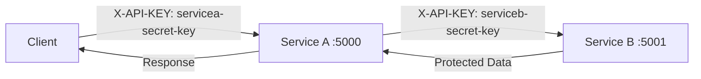

# 🔐 API-Based Authentication for Service-to-Service Communication

[](https://python.org)
[](https://flask.palletsprojects.com/)
[](LICENSE)

## 📖 Overview

This project demonstrates **API key-based authentication** for secure service-to-service (S2S) communication in a microservices architecture. It showcases how services can authenticate each other using API keys while maintaining security boundaries.

## 🏗️ Architecture



### Components

- **Service A** (`service_a.py`) - Gateway service that handles client requests and forwards them to Service B
- **Service B** (`service_b.py`) - Data service that provides protected resources
- **Client** - External consumer that accesses Service A with proper authentication

## 🔑 Authentication Flow

1. **Client Authentication**: Client sends request to Service A with `servicea-secret-key`
2. **Service Validation**: Service A validates the client's API key
3. **Service-to-Service Call**: Service A calls Service B using `serviceb-secret-key`
4. **Data Retrieval**: Service B validates Service A's key and returns protected data
5. **Response**: Service A forwards the response back to the client

## 🚀 Getting Started

### Prerequisites

- Python 3.x
- Flask
- Requests library

### Installation

```bash
# Install required dependencies
pip install flask requests
```

### Running the Services

1. **Start Service B** (Terminal 1):
```bash
python service_b.py
```
Service B will start on `http://localhost:5001`

2. **Start Service A** (Terminal 2):
```bash
python service_a.py
```
Service A will start on `http://localhost:5000`

## 🧪 Testing the API

### ✅ Successful Authentication

Test with the correct API key:

```bash
curl -H "X-API-KEY: servicea-secret-key" http://127.0.0.1:5000/call_service_b
```

**Expected Response:**
```json
{
  "service_b_response": {
    "data": "Protected data from ServiceB."
  },
  "status_code": 200
}
```

### ❌ Failed Authentication

Test with an incorrect API key:

```bash
curl -H "X-API-KEY: wrong-key" http://127.0.0.1:5000/call_service_b
```

**Expected Response:**
```json
{
  "error": "Unauthorized"
}
```

## 🔒 Security Considerations

### Best Practices Implemented

- ✅ **API Key Validation**: Both services validate incoming API keys
- ✅ **Service Isolation**: Each service has its own authentication mechanism
- ✅ **Error Handling**: Proper HTTP status codes for unauthorized access

### Production Recommendations

- 🔐 **Environment Variables**: Store API keys in environment variables, not hardcoded
- 🔄 **Key Rotation**: Implement regular API key rotation
- 📝 **Audit Logging**: Log all authentication attempts
- 🌐 **HTTPS Only**: Use HTTPS in production environments
- ⏰ **Rate Limiting**: Implement rate limiting to prevent abuse
- 🛡️ **Additional Headers**: Consider using additional security headers

## 📂 File Structure

```
ApiBasedAuthentication/
├── README.md           # This documentation
├── service_a.py        # Gateway service (Port 5000)
└── service_b.py        # Data service (Port 5001)
```

## 🔧 Configuration

### API Keys Configuration

| Service | API Key | Purpose |
|---------|---------|---------|
| Service A | `servicea-secret-key` | Client authentication |
| Service B | `serviceb-secret-key` | Service-to-service authentication |

### Environment Setup (Recommended)

```bash
# Set environment variables
export SERVICE_A_API_KEY="your-service-a-key"
export SERVICE_B_API_KEY="your-service-b-key"
```

## 🌟 Use Cases

This pattern is ideal for:

- **Microservices Architecture**: Secure communication between internal services
- **API Gateway Pattern**: Authentication at the gateway level
- **Legacy System Integration**: Simple authentication for existing systems
- **Development/Testing**: Quick setup for development environments

## 🔄 Alternative Authentication Methods

While this example uses API keys, consider these alternatives for production:

- **JWT Tokens**: For stateless authentication with claims
- **OAuth 2.0**: For third-party integrations
- **mTLS**: For certificate-based authentication
- **Service Mesh**: For automatic service-to-service security

## 🤝 Contributing

1. Fork the repository
2. Create a feature branch (`git checkout -b feature/amazing-feature`)
3. Commit your changes (`git commit -m 'Add amazing feature'`)
4. Push to the branch (`git push origin feature/amazing-feature`)
5. Open a Pull Request

## 📝 License

This project is licensed under the MIT License - see the [LICENSE](LICENSE) file for details.

## 📚 Additional Resources

- [Flask Documentation](https://flask.palletsprojects.com/)
- [API Security Best Practices](https://owasp.org/www-project-api-security/)
- [Microservices Security Patterns](https://microservices.io/patterns/security/)

---

**💡 Note**: This is a educational example. For production use, implement additional security measures and follow your organization's security guidelines.


